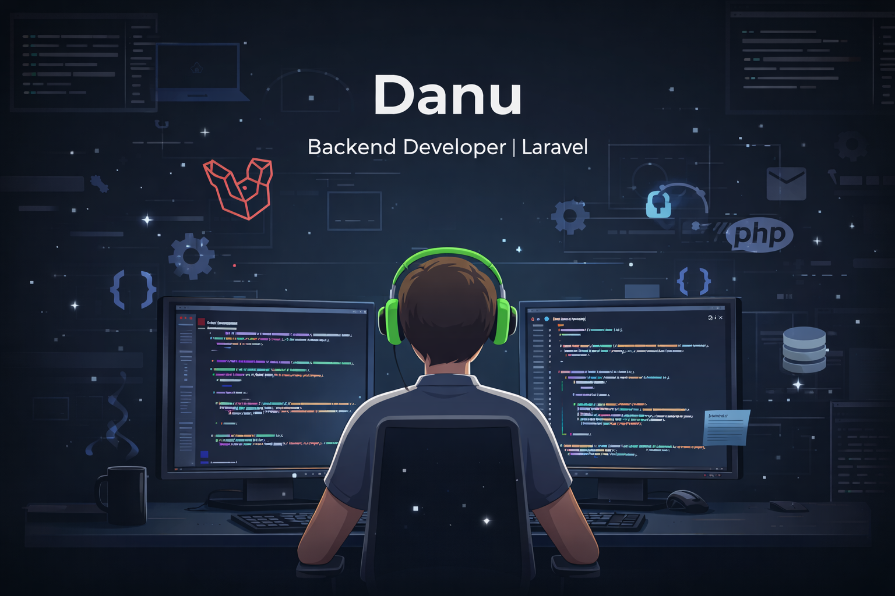

<h1 align="center">Welcome I'm Danu Anggo</h1>
<h3 align="center">Backend Developer | Laravel & API Enthusiast</h3>

  

---

## 👨‍💻 About Me
- 🇮🇩 From Indonesia  
- 💻 Backend Developer (Laravel, PHP)  
- 🔌 Interested in API, Auth, Payment System  
- 🌱 Currently learning **CI/CD & Clean Architecture**  
- 🎯 Goal: Professional Backend Engineer  

---

## 🛠️ Tech Stack

  

---

## 🖼️ My Poster

  

---

## 📊 GitHub Stats

  

  

---

## 🌐 Connect with Me
- GitHub: https://github.com/danu565
- Instagram: https://www.instagram.com/danu_anggo
- Portfolio: https://mijurnal.com | https//smart.hummatech.com/

---

⭐ _Feel free to explore my repositories and give a star if you like it!_
